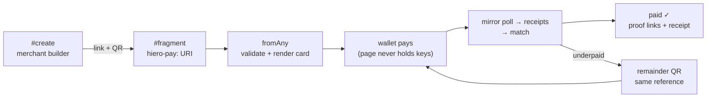
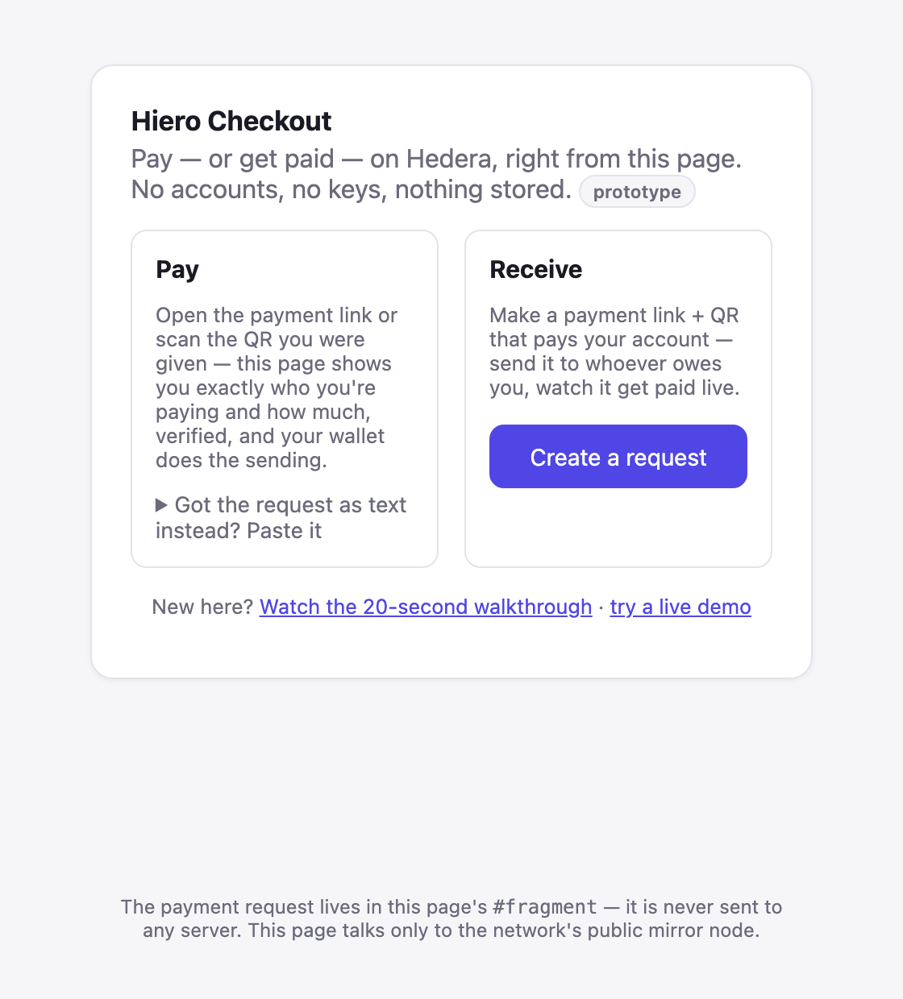
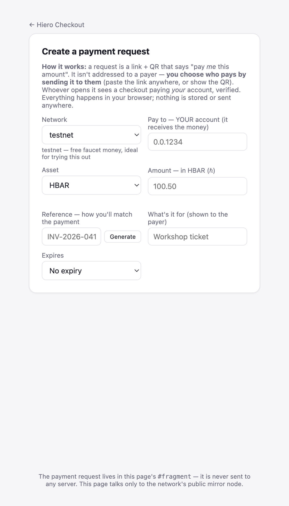
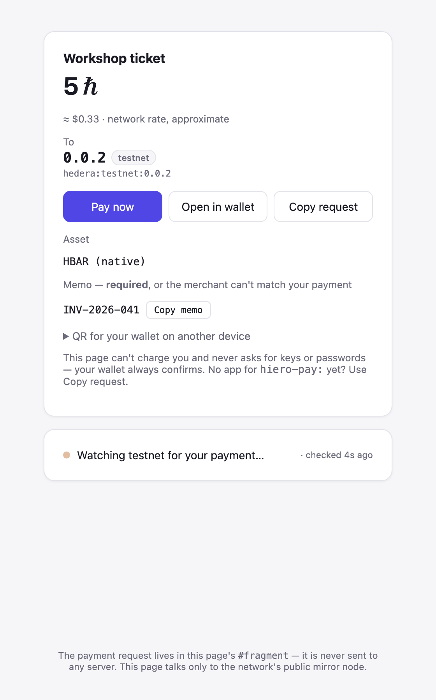
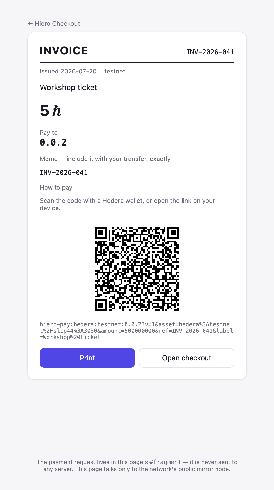

# hiero-checkout

**The payer side of payments on Hiero: scan → review → pay with your wallet →
watch it confirm live.**

A static page — no backend, no keys, no analytics, no configuration. It is the
universal-link target for [`toLink`](https://github.com/hiero-hackers/hiero-payment-requests):
a phone that scans a payment QR opens this page, and the page does the rest.
Prototype.



## See every state, right now

```sh
npm install && npm run dev   # → http://localhost:5173
```

| State                                             | URL                                                                                                                                                                   |
| ------------------------------------------------- | --------------------------------------------------------------------------------------------------------------------------------------------------------------------- |
| **The whole lifecycle, simulated, in 20 seconds** | `/#tour` — request → partial payment + remainder QR → settled with proof + receipt. Real matcher, real renderers; only the data is simulated, and the banner says so. |
| Landing / paste screen                            | `/` (has a **Try a demo** button — a live testnet request)                                                                                                            |
| Merchant builder                                  | `/#create` — link + QR appear as you type, checksum added for you                                                                                                     |
| Payer card, live watching                         | any `#hiero-pay:` fragment, or **Open checkout** from the builder                                                                                                     |
| Expired request                                   | builder → expires in 1 minute → wait                                                                                                                                  |
| Damaged link                                      | `/#hiero-pay:hedera:mainnet:0.0.1234-wrong?v=1&asset=hedera%3Amainnet%2Ftoken%3A0.0.720&amount=1&ref=X`                                                               |
| Dark mode / mobile                                | OS theme; narrow the window (the QR folds away on phones)                                                                                                             |

## The walkthrough, in pictures

**1 · Choose your side.** Payers usually never see this — a payment link drops
them straight onto the request. Merchants tap Create; the curious take the
tour or the live demo.



**2 · Merchant: create the request.** Network defaults to testnet (faucet
money), the checksum and token decimals are computed for you, the amount is
grounded in exact base units with a $ estimate, and expiry is a human
duration. Out comes a link + QR — send either to whoever owes you; that's how
a request is "addressed".



**3 · Payer: review and pay.** Everything verified before it's shown —
checksummed recipient, exact amount, the required memo one tap from the
clipboard. On testnet, **Pay now** pairs with a wallet (HashPack, Kabila,
Blade) over WalletConnect and the wallet signs; the page then watches the
public mirror until the verdict flips to paid ✓ — with on-chain proof links
and a downloadable receipt.



**4 · Need paper?** Any request renders as a printable invoice — the
reference is the invoice number, the QR is the payment instruction.



(Screenshots are reproducible output, not relics: `npm run screenshots`
against a running dev server regenerates them.)

## Why it's this small (~21 kB gzipped to first paint)

Everything hard ships in the published libraries; this repo is glue:

| Concern                                                  | Where it lives                                                                    |
| -------------------------------------------------------- | --------------------------------------------------------------------------------- |
| Parse scanned/pasted/linked input                        | `fromAny` — payment-requests                                                      |
| Validate (checksums, networks, amounts)                  | `createRequest` via every entry point                                             |
| What to show + hand a wallet                             | `paymentInstructions`                                                             |
| The QR itself                                            | `toQRSVG` — the in-house, decoder-verified encoder                                |
| Amounts as text, no floats                               | `formatBaseUnits`                                                                 |
| Normalize mirror transactions (net credits, custom fees) | `fromMirror` + `receiptFor` — hiero-receipts                                      |
| The verdict                                              | `match` — the SAME rule the merchant runs; the two ends cannot disagree           |
| The keepsake                                             | `toHTML` — hiero-receipts renders the downloadable receipt                        |
| Pay in-page (testnet only)                               | `@hashgraph/hedera-wallet-connect` — the WALLET signs; this page never holds keys |

The page adds ~1,400 lines: a thin typed `fetch` for three mirror endpoints
(deliberately not a data-client dependency), a poll loop, framework-free DOM
rendering, and the WalletConnect hand-off. The wallet stack itself is
LAZY-LOADED chunks — payers who never tap Pay now never download or execute
it, and in-page payment is **testnet-only** while this is a prototype
([src/config.ts](src/config.ts)).

## Privacy properties (the point of the design)

- The request rides in the **URL fragment** — browsers never send fragments,
  so payment details stay out of every server, proxy, and access log.
- The page talks **only** to the network's public mirror node, derived from
  the network inside the request's own CAIP identifiers.
- Everything rendered is derived from the **parsed** request — never echoed
  from raw input — so what the payer sees is what was validated, checksummed
  recipient included. A wrong checksum renders a refusal, not a card.

## Develop

```sh
npm install           # @hiero-hackers packages come from GitHub Packages —
                      # you need the usual read:packages token in ~/.npmrc
npm run dev           # → http://localhost:5173
npm run verify        # typecheck + lint + format + tests + build + dist checks
```

Try it with a request: `npm run dev`, then open

```
http://localhost:5173/#hiero-pay:hedera:mainnet:0.0.1234-pikcw?v=1&asset=hedera%3Amainnet%2Ftoken%3A0.0.720&amount=100000000&ref=INV-2026-041&label=Workshop%20ticket
```

The tests consume the **official wire vectors** shipped inside
payment-requests — this app is the vectors' first external consumer: every
valid vector must render, every invalid one must be refused.

## Roadmap

- ~~WalletConnect~~ **DONE** — "Pay now" pairs via
  `@hashgraph/hedera-wallet-connect` (lazy-loaded; the entry stays ~21 kB
  gzipped), proposes the transfer with the memo intact, and the wallet signs.
  Remaining: a real-device pass with HashPack on testnet.
- **GitHub Pages deploy** + CI (verify gates, SPDX/browser drift checks — kit
  parity with the sibling repos).
- **Underpaid → remainder QR** via `remainderRequest` (the library call
  exists; the screen needs designing).
- Upstream: an `exports` subpath for the vectors file in payment-requests,
  and a browser-cleanliness pin for hiero-receipts (this app is the reason).

## What it deliberately doesn't do

Hold keys · sign anything · run a server · track anyone · guess (unknown
token decimals render as base units, labeled as such; unverifiable input
renders a refusal).

## License

Apache-2.0
